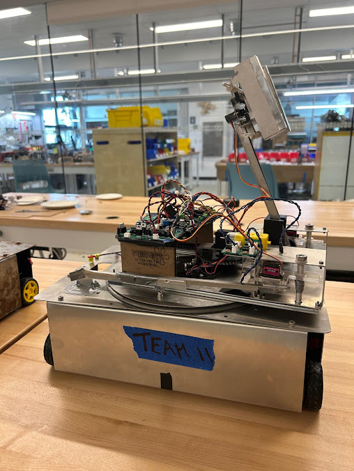

+++
title = '1: Robot'
date = 2024-09-25T23:15:10-07:00
+++

Hello and welcome to my first real update. This inaugural post will (briefly) document the assembly of my team's robots for the ENPH253 course.

Our challenge this year was unlike any previous one: we had to build not one, but two fully autonomous robots that could serve 3d printed food. 

I took on the role of electrical designer and learned Altium in the first few days of the project. Along with manufacturing some parts for the robots and troubleshooting their behavior with code I iterated through many trial circuits and designed some PCBs.

    
    <i>Fig. 1. Debouncer circuit by me.</i>

This was one of many circuits used by the robot. Buttons tend to be "bouncy" and provide multiple outputs per press, so this board smoothed out the erratic signal to a single rising edge.

    
    <i>Fig. 2. PCB layout designed by yours truly.</i>

Using my world-class altium expertise I put together this bad boy. The silly graphics are there because our team name was the Krusty Krab. (they should be yellow, as red means wiring... not sure what happen)

    
    <i>Fig. 3. A stunning render of my immaculate board.</i>

Yes this is exactly what it looked like in real life. No there were no silly oversights. Of course not.

    
    <i>Fig. 4. I wonder who connected this fabulous wiring.</i>

On August 7th, the day before the competition, our robots did not work. So we did what generations of students have done before us and partook in the traditional all-nighter to complete it.

Unfortunately this was my first ever all nighter. The latest I have ever submitted an assignment (and consequently gone to bed) was probably 4 or 5, but until that day I had never witnessed two consecutive sunrises in a row. 

 <i> I celebrated with a couple others with a mcdonalds run. It is 5 am in this photo </i> 

After testing through the night it was comp day. We had practically rebuilt our robots from scratch and simplified our objective from assembling a burger (which required many steps such as cooking, stacking, and coordinating) to delivering a piece of cheese on a plate. Having once ridiculed the absurdity of this 'recipe' the irony of this was not lost on us.

When it was our turn to shine, we first missed the cheese. Then the plate. Then through frantic last minute adjustments a miracle happened.



This absolute trooper pulled through and served the cheese to the ecstatic audience. Next to our opponents who were cooking up a storm, that may not have looked like much, but I think it was evident in our reaction that the cheese plate was the culmination of hundreds of man-hours of effort, and the audience clearly recognized it. I may be falling victim to self-serving bias, but after experiencing the event and rewatching the stream, I still think our cheese plate got the most vigorous applause of the entire event.

_Our beloved robots._

The keen eyed among you may notice that although the events discussed all occurred during summer, the publishing date is much later. This is because I ~~forgot~~ was very busy and ~~hate microsoft~~ didn't want to set up git in vscode. I tried building the site in codespaces probably at least 20 times using 2 different frameworks, but it would never upload. Today I finally pulled myself together and followed [this tutorial](https://www.youtube.com/watch?v=zrmeOu8DYyw); with some help from chat it actually went quite smoothly. 

~~This was written up rather hastily and late at night so it will be revised soonish.~~

Until next time.