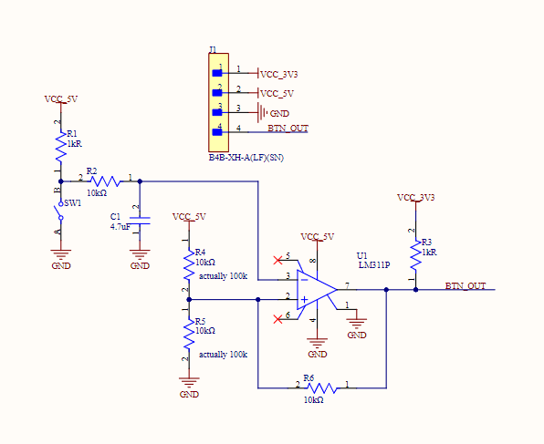
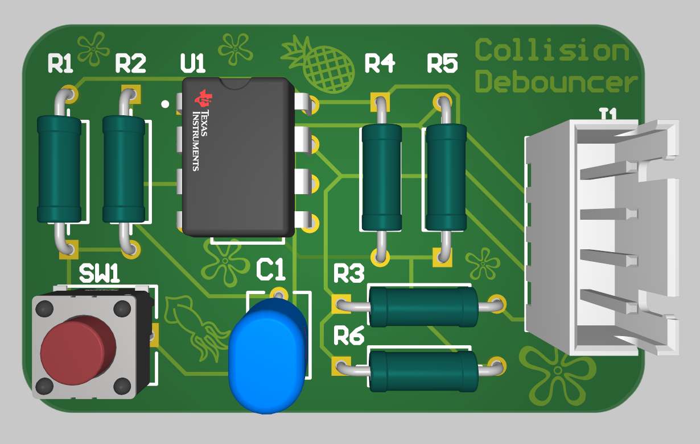
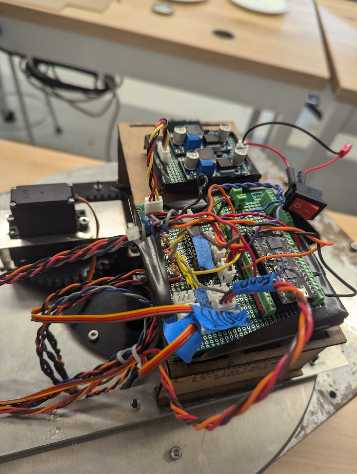
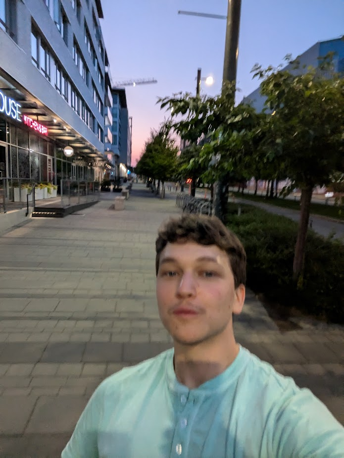

+++
title = 'Week 1: In Retrospect'
date = 2024-09-25T23:15:10-07:00
+++

Welcome to my blog. Here I aim to write biweekly chronicles of what I am up to.

This inaugural post will document the assembly of my robot.

Over the last four months my peers and I traversed the proving ground known as robot summer. May to June was the practice round, 6 classes in half a semester, piece of cake for the masochists that populate the faculty, but July marked the start of the scorch trial.

For the first time ever we were to build 2 robots per team. A formidable challenge for even the sweats among our ranks.

I found myself some carrys for mech and code and settled nicely into my elec role. After learning Altium in a couple days I got to work.

    
    <i>Fig. 1. Debouncer circuit by me.</i>

This was one of many circuits used by the robot. Buttons tend to be "bouncy" and provide multiple outputs per press, so this board would smooth out the signal to a single rising edge.

    
    <i>Fig. 2. PCB layout designed by yours truly.</i>

Using my newfound altium expertise I put together this bad boy. The silly graphics are there because our team name was the Krusty Krab. (they should be yellow...)

    
    <i>Fig. 3. A stunning render of my immaculate board.</i>

Yes this is exactly what it looked like in real life. No there were no silly oversights. Yes we did end up using it in the final design. Very useful.

    
    <i>Fig. 4. I wonder who connected this fabulous wiring.</i>

August 7th, day before the competition. Our robots don't work. So we honored the age old tradition of pulling an all nighter to get them up to shape.

Unfortunately this was my first ever all nighter. I did hand in my extended essay at 3, and completed my cardboard chair at 4, but never before did I bear witness to two consecutive sunrises. I celebrated with a couple others with a dons run.

 <i> it is 5 am in this photo </i> 

After testing through the night it was suddenly August 8th. Comp day.

When it was our turn to shine we missed cheese once. Then twice. Then through frantic last minute adjustments a miracle happened.

<video>
    <source src="videos/cheese.mp4" type="video/mp4">
</video>

The keen eyed among you may notice that although the events discussed all occurred during summer, the publishing date is much later. This is because I ~~forgot~~ was very busy and ~~hate microsoft~~ didn't want to set up git in vscode. I tried building the site in codespaces probably at least 20 times using 2 different frameworks, but it would never upload. Today I finally pulled myself together and followed [this video](https://www.youtube.com/watch?v=zrmeOu8DYyw); with some help from chat it actually went quite smoothly. 

This was written up rather hastily and late at night so it will be revised soonish.

Until next time.