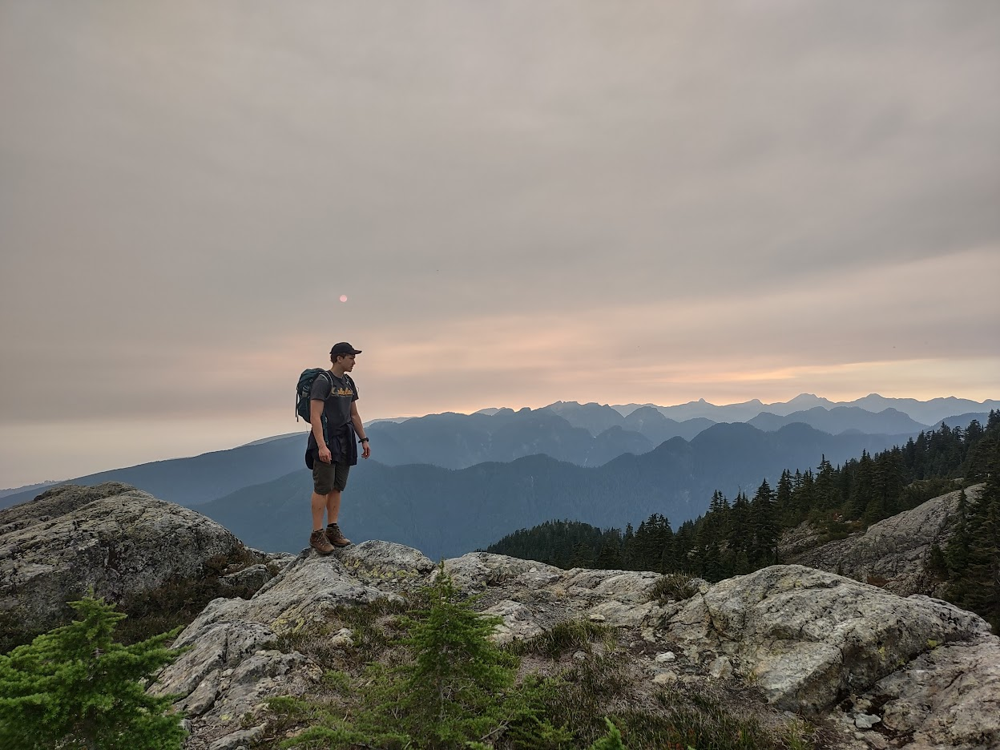

Welcome to my website.

I update it every so often with stories about my projects and other exciting things from my life.

Thanks to [Steven Chen](https://shengwen.me/) for inspiring me to start it and helping set it up.

I'm mostly a hardware guy, but my code projects can be found on my [github](https://github.com/ron-kit/).

---

Below are a few tests to see if these features still work whenever I update the framework/theme

## Cat video



\[\\\]

## Text experiments

 This is green,
 this is blue,
 this is purple

This is cool

Hover over to see the <abbr title="Eat your vegetables">secret message </abbr>

||Left|Right|
|-|-|-|
|**Up**|_Italic_|**Bold**|
|**Down**|~~Strike~~|<u>Line</u>|

\[ u(r,z,t) = \sum_{n=1}^\infty \sum_{m=1}^\infty \sin \left( \frac{m\pi z}{h}\right)J_0 \left( \sqrt{\mu_n}r \right)e^{-\lambda_{mn}Dt} \]

